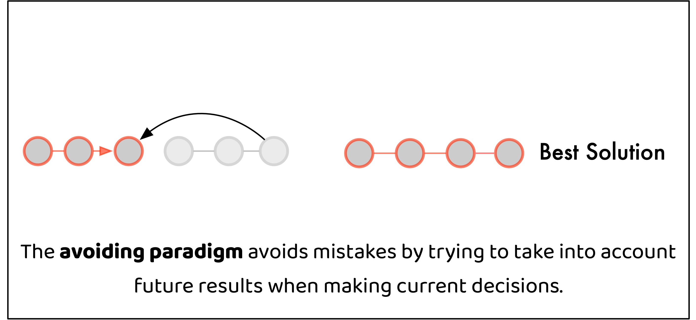
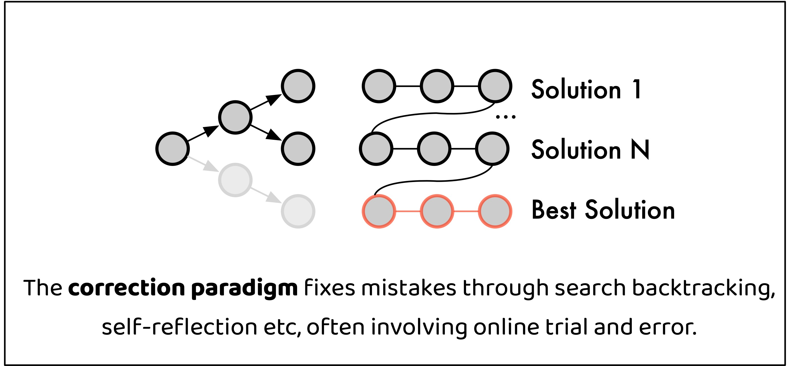

# Non-Myopic Generation of Language Models for Reasoning and Planning (ICLR 2025)
[Non-Myopic Generation of Language Models for Reasoning and Planning📝](https://openreview.net/pdf?id=OoNazl6T7D)


## Callback on Motivation
As strong reasoning and planning abilities emerge in Large Language Models (LLMs), LLMs become the de facto solver for complex problems. LLMs are unique in their step-by-step problem solving ability, the ability to perform sequential planning through autoregressive generation. However, errors tend to exist during planning as autoregressive generation are often imperfect, and it is fundamentally challenging to generate global-aware solutions at earlier steps.

As shown in the figure below, there are two solutions fixing this. The first is to fix the errors by correcting the mistakes, i.e. self-reflection. Most of the past work has been quite focused on demonstrating and improving the effectiveness of this paradigm. However, self-reflection abilities of many LLMs are limited and training generalizable reflection models are hard. We on the other hand, want to place emphasis on the second paradigm, avoiding the mistakes from happening. We show in our series of work [Predictive-Decoding](https://openreview.net/pdf?id=OoNazl6T7D), [Phi-Decoding](https://arxiv.org/pdf/2503.13288), [Genius](https://arxiv.org/pdf/2504.08672) how this could be implemented in a very simple decoding method that works for math, coding and agent tasks.

<div style="display: flex; justify-content: center; gap: 20px;">

  <figure>
    
  </figure>

  <figure>
    
  </figure>

</div>

Predictive Decoding simulates an Energy-Based model such that it performs autoregressive generation, but aims to optimize global planning. For each step, the LLM generates T steps ahead, and samples the action for current step t based on LLM self-evaluation at step t+T. We find without using any additional reward model, directly optimizing LLM future logprob yields impressive improvement.

**See our latest follow-up work**:

- Further speedup: [phi-decoding: Adaptive Foresight Sampling for Balanced Inference-Time Exploration and Exploitation](https://arxiv.org/pdf/2503.13288) (ACL 2025)

- PD for RL sampling: [Genius: A Generalizable and Purely Unsupervised Self-Training Framework For Advanced Reasoning](https://arxiv.org/pdf/2504.08672) (ACL 2025)

Also see [phi-decoding](https://github.com/xufangzhi/phi-Decoding/blob/main/baselines/Baseline-PD-aime.py) repo for implementation of predictive decoding on AIME and latest models (Qwen, Deepseek). 


## Quick Start 
## Prepare environment
The agent environment is mainly built upon AgentBoard, which supports agent experiments AlfWorld and PDDL. 
Please refer [here](https://github.com/hkust-nlp/AgentBoard?tab=readme-ov-file#setup-environment) for a detailed setup guide.
For math tasks and vllm dependency, install `pip install -r requirements.txt`.
There might be version conflict between the agent environment and vllm dependencies. It is recommended to install the two environments independently, and launch vllm as service.

## Dataset
download agent tasks dataset. 
```
cd dataset
wget https://huggingface.co/datasets/hkust-nlp/agentboard/resolve/main/data.tar.gz
tar -zxvf data.tar.gz
```
download gsm8k from huggingface.
```
cd dataset
huggingface-cli download openai/gsm8k --repo-type dataset --local-dir gsm8k

```

## Run Predictive Decoding
Requires one 80G GPU to run 8B LLM.
```
CUDA_VISIBLE_DEVICES=0 python agentboard/eval_reasoning_parallel.py
  --cfg-path eval_configs/gsm8k/mpc_sample_gsm8k_llama3.yaml
  --tasks gsm8k --algorithm MPC_Sample
  --model llama-3
  --data_path $PROJECT_DIR/data/gsm8k
  --batch_size 500
```
More scripts on running Predictive Decoding on other tasks, and scripts for baselines on available [here](/scripts/run.sh).
## Run Reward-guided Predictive Decoding
Requires two 80G GPU to run 8B LLM and 7B reward model.

First launch [Math-Shepherd](https://arxiv.org/pdf/2312.08935) reward model: 
```
vllm serve peiyi9979/math-shepherd-mistral-7b-prm
```
Set `OPENAI_API_BASE = "http://localhost:8000/v1"` in `.env` file. 

Run reward-guided predictive decoding: 
```
python agentboard/eval_reasoning_reward_parallel.py
  --cfg-path eval_configs/gsm8k/mpc_reward_gsm8k_llama3.yaml
  --tasks gsm8k --algorithm MPC_Sample_Reward
  --model llama-3 --data_path $PROJECT_DIR/data/gsm8k
  --batch_size 2000
  --reward_model math-shepherd
```

## Change Parameters for Analyzing Test-time Scaling Law
See commands in `scripts/run_scaling_law.sh`.

## Citation
If you find this repository useful, please consider giving star and citing our paper:
```
@article{ma2024non,
  title={Non-myopic Generation of Language Models for Reasoning and Planning},
  author={Ma, Chang and Zhao, Haiteng and Zhang, Junlei and He, Junxian and Kong, Lingpeng},
  journal={arXiv preprint arXiv:2410.17195},
  year={2024}
}
```


